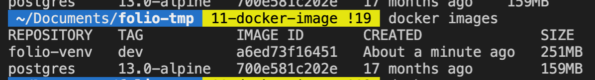
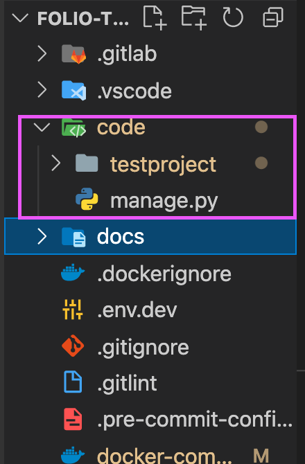
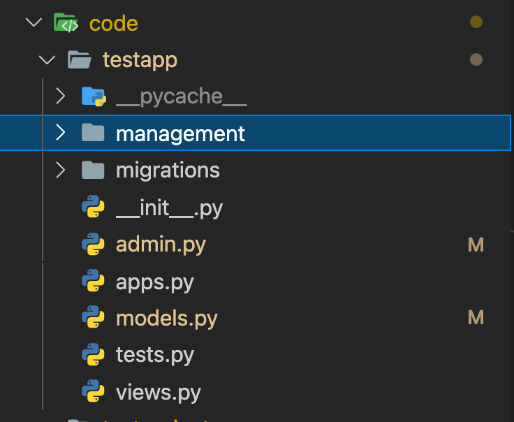
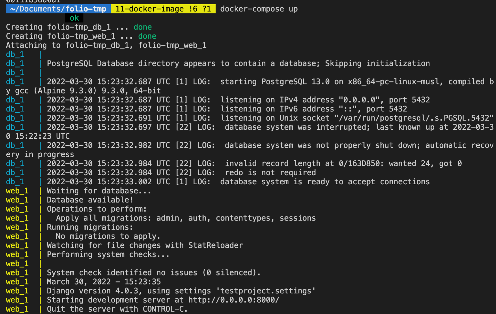
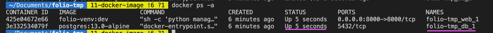
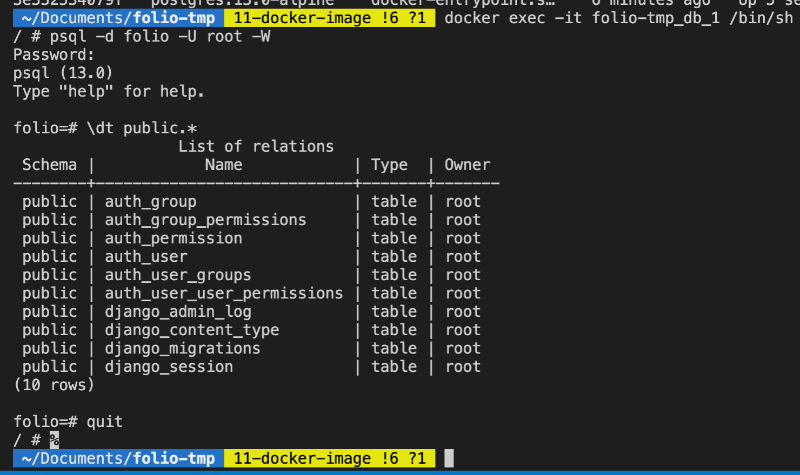

1. 建立 folio-venv 的 image。
    ```
    docker-compose build
    docker images
    ```
    

2. 建立 Django Project，建立完應該可以在 `code` 資料夾中看到我們剛建立的 testproject。
    ```
    docker-compose run --rm web sh -c "django-admin startproject testproject ."
    ```
    

3. 建立 Django App， 建立完應該可以在 `code` 資料夾中看到我們剛建立的 testapp。
4. 修改 testproject/settings.py 裡的內容，我們要利用環境變數來更改設定 
    ```python=
    # 引入會用到的套件
    import dj_database_url
    from decouple import Csv, config

    # SECRET_KEY/DEBUG/ALLOWED_HOSTS 改成用環境變數操控
    SECRET_KEY = config('SECRET_KEY')
    DEBUG = config('DEBUG', default=False, cast=bool)
    ALLOWED_HOSTS = config('ALLOWED_HOSTS', cast=Csv())

    # 加入自定義的 app
    INSTALLED_APPS = [
        'django.contrib.admin',
        'django.contrib.auth',
        'django.contrib.contenttypes',
        'django.contrib.sessions',
        'django.contrib.messages',
        'django.contrib.staticfiles',

        # local apps
        'testapp',
    ]

    # DATABASES 改成 postgresql 並用環境變數控制
    DATABASES = {
        'default': dj_database_url.config(
            default=config('DATABASE_URL')
        )
    }
    ```

5. 再啟動 Django server 前要先確保 DB 已經開好，所以請加入一個自定義的 `wait_for_db` command。請將 docs/docker-readme 底下的 `management` 整個複製到 `testapp` 底下。
    

6. 跑起 server。打開 `localhost:8000` 就可以看到畫面。
    ```
    docker-compose up
    ```
    


#### 如何進到 psql ?
1. 輸入 `docker ps -a` 確認 db 的 container 有在 run。
    

2. 進到 db container 的 shell
    ```shell
    $ docker exec -it folio-tmp_db_1 /bin/sh
    ```
3. 進到 psql，會要你輸入密碼：範例是 secret1234
    ```
    / # psql -d folio -U root -W
    ```
4. 再看看 public 底下的 Django tables 應該都匯入了。
    ```
    folio=# \dt public.*
    ```
5. 輸入 `quit` 離開 psql 並按 `ctrl+D` 離開 db container 的 shell
    
